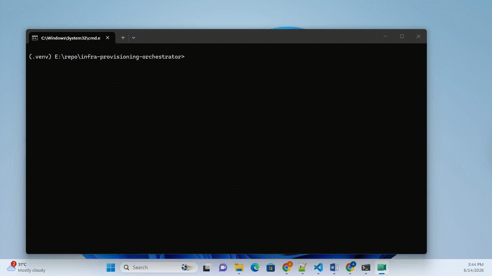

# bulwark

[](https://github.com/arpitjain310/bulwark/actions/workflows/ci.yml)

> Provision a multi-resource stack from a declarative spec — with idempotent
> re-runs, partial-failure rollback that preserves durable resources, and a
> teardown that *structurally cannot* delete protected resources.

**Status:** work in progress.

## Demo



The demo provisions a five-resource stack on real AWS — an S3 bucket (`storage`,
durable), a DynamoDB table (`database`, protected), and ephemeral `network`,
`compute`, and `load_balancer`.

1. **Apply fails at `compute`** (step 4 of 5). Rollback runs in reverse
   dependency order: it deletes the ephemeral `network` it just created, but
   preserves the durable bucket and the protected table — a half-finished run
   never destroys the resources that hold data.
2. **Re-apply converges.** The bucket and table already exist and are skipped;
   only the missing resources are created.
3. **Teardown is refused.** `database` is protected, so the whole destroy is
   rejected before anything is deleted.

---

## The problem

Provisioning tooling is easy to demo and hard to make safe. The interesting
failures are not "create a resource" — they're what happens *between*
resources:

- A re-run should be a **no-op** when reality already matches the spec.
- A run that fails **halfway** must clean up after itself — but cleaning up
  blindly is how you delete a production database. Some resources are
  **durable**: created once, preserved across rollbacks. Others are
  **ephemeral**: safe to tear down.
- Some resources must be **un-deletable by construction**, not by convention.

That durable-vs-ephemeral separation — knowing precisely what a rollback is
allowed to destroy — is what this repo is about.

## What it does

```
spec.yaml ──▶ parse + validate ──▶ plan (dependency order) ──▶ apply ─┐
                                                                       │
                              ┌──── success: persist state ◀───────────┘
                              │
                              └──── partial failure ──▶ ROLLBACK
                                       tear down ephemeral created this run,
                                       PRESERVE durable, NEVER touch protected
```

- **Declarative spec** (`spec.py`) — resources, dependencies, and a per-resource
  `protection` level. Bad input is rejected loudly (duplicate names, unknown
  dependencies, dependency cycles, unknown fields).
- **Pluggable provider** (`provider.py`) — the engine speaks one contract; the
  in-memory `MockProvider` and a real AWS backend (`AwsProvider`) implement it.
- **Idempotent apply** (`engine.py`) — resources created in dependency order;
  re-applying skips what already exists.
- **State store** (`state.py`) — records what's been created so re-runs converge.
- **Rollback / teardown** (`rollback.py`) — on partial failure, tears down this
  run's resources in reverse dependency order, preserving durable ones and
  refusing to touch protected ones. Resumable: a rollback that fails partway
  re-runs to convergence.

## Explicit non-goals

Scope is the bottleneck, not time. This repo deliberately does **not**:

- Aim to be a Terraform/Pulumi replacement — the value is the **engine**, not
  breadth of providers.
- Manage drift detection, remote state locking, or multi-user concurrency.
- Require cloud credentials to develop or test — everything runs against a
  **mock** provider; one real backend is wired to prove the engine works against
  real infrastructure.
- Provide a config DSL beyond a small validated YAML spec.

## The protection ladder

Each resource selects a single protection level. These levels form an ordered
hierarchy of retention, and rollback and teardown interpret them differently:

```
                rollback        teardown
ephemeral       delete          delete
durable         preserve        delete
protected       preserve        refuse the run
```

Using a single protection level makes contradictory policies impossible to
express — a resource cannot be marked protected without also being durable.

## Rollback behaviour

- **Reverse-topological:** dependents are deleted before their dependencies.
- **Preserve by class:** durable resources survive a rollback, while protected ones are
  never touched.
- **Resumable:** the target set is journaled to the state file and the order is
  recomputed from the graph, so a rollback interrupted by a failed delete re-runs
  from disk and converges. This requires delete operations to be idempotent.
- **Best-effort completion:** A failed delete does not prevent subsequent deletes from running. After all possible operations have been attempted, a RollbackError is raised containing the list of failures, with the original apply error preserved as the cause.

## Teardown behaviour

Teardown is an explicit request to destroy the entire stack. Unlike rollback, it
deletes durable resources as well. However, if any resource is marked protected,
teardown refuses the entire operation and deletes nothing — mirroring Terraform's
`prevent_destroy`.

Rollback and teardown use the same deletion engine but apply different policies.
Rollback preserves protected resources because it is recovering from a partially
completed apply and must reach a consistent end state. Teardown, by contrast,
treats protected resources as a safeguard against unintended destructive actions
initiated by the user.

## Real backend (AWS)

The engine is provider-agnostic. AWS is the one real backend:

- `s3_bucket` → a real S3 bucket, seeded with an object (durable storage)
- `dynamodb_table` → a real DynamoDB table, seeded with a row (protected database)

Other resource types are tracked in-process and don't call AWS. Every run emits
one lifecycle event per resource transition to stderr (a JSON line: resource,
action, status, duration).

A second real backend, `LocalFilesystemProvider` (`--provider local`), maps each
resource to a directory on disk — the same contract, different implementation,
and the one used to test a real provider end to end in CI.

## Quickstart

```bash
python -m venv .venv && . .venv/bin/activate   # Windows: .venv\Scripts\activate
pip install -e ".[dev]"
pytest -q
orchestrate apply examples/stack.yaml

# Simulate a partial failure rollback: app fails, the durable/protected layers survive.
orchestrate apply examples/stack.yaml --simulate-failure app

# Against real AWS (needs credentials; set a unique bucket name in the spec first):
pip install -e ".[aws]"
orchestrate apply examples/aws-stack.yaml --provider aws --region us-east-1
orchestrate teardown examples/aws-stack.yaml --provider aws   
```
